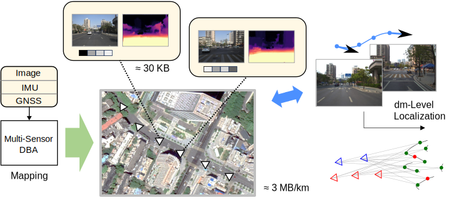

# SF-Loc

>SF-Loc: A Visual Mapping and Geo-Localization System based on Sparse Visual Structure  Frames


<div align=center>

</div>

[[Paper](https://arxiv.org/abs/2412.01500)]

**An important typo**: In the current version of the manuscript, there is a description ``to verify the effectiveness of the proposed SSS metric, we also implement a naive multi-frame VPR model by clustering the top-K candidates of multiple queries''. Here, "top-K" should be "top-10". Sorry for this typo.

## What is this? 

**SF-Loc** is vision-centered mapping and localization system, based on the map representation of visual structure frames. We use **multi-sensor dense bundle adjustment (MS-DBA)** to generate the visual structure frames and sparsify them through co-visibility checking, leading to lightweight map storage. On this basis, multi-frame information is utilized to achieve high-recall, accurate user-side **map-based localization**.

## Update log
- [x] Mapping Pipeline (deadline: 2024/12)
- [x] Localization Pipeline (deadline: 2025/01)
- [ ] Some gifs

## Installation
The pipeline of the work is based on python, and the computation part is mainly based on Pytorch (with CUDA) and GTSAM.

Use the following command to set up the python environment.

```Bash
conda create -n sfloc python=3.10.11
conda activate sfloc
pip install torch==1.11.0+cu113 torchvision==0.12.0+cu113 torchaudio==0.11.0 --extra-index-url https://download.pytorch.org/whl/cu113
pip install torch-scatter==2.0.9 -f https://data.pyg.org/whl/torch-1.11.0+cu113.html
pip install gdown tqdm numpy==1.25.0 numpy-quaternion==2022.4.3 opencv-python==4.7.0.72 scipy pyparsing matplotlib h5py 
```

As for GTSAM, we make some modifications to it to extend the python wrapper APIs, clone it from the following repository and install it under your python environment.

```Bash
git clone https://github.com/yuxuanzhou97/gtsam.git
cd gtsam
mkdir build
cd build
cmake .. -DGTSAM_BUILD_PYTHON=1 -DGTSAM_PYTHON_VERSION=3.10.11
make python-install
```

Finally, run the following command to compile the project.

```Bash
git clone --recurse-submodules https://github.com/GREAT-WHU/SF-Loc.git
cd SF-Loc
python setup.py install
```


## Run SF-Loc
We use the weights of [DROID-SLAM](https://github.com/princeton-vl/DROID-SLAM?tab=readme-ov-file) trained on TartanAir for optical flow estimation and DBA. Download [droid.pth](https://drive.google.com/file/d/1PpqVt1H4maBa_GbPJp4NwxRsd9jk-elh/view?usp=sharing) and put it in this project.

<div align=center>

</div>

### 1. Mapping Phase

In the mapping phase, multi-sensor data are used for dense bundle adjustment (DBA) to recover image depths and poses. Based on the global optimization results, the lightweight structure frame map is generated. 

1.1 Download the [WHU1023](https://whueducn-my.sharepoint.com/:u:/g/personal/2015301610143_whu_edu_cn/EQX_UOB79AhHlsSI7hb2Jd4B69qd367NCMHOAcFZi7N5Mg?e=gi9NP1) data sequence.

1.2  Specify the data paths in [launch_dba.py](launch_dba.py), then run the following command 
```Bash
python launch_dba.py  # This would trigger demo_vio_WHU1023.py automatically.
```
This will launch a task for online multi-sensor DBA. Generally, **1x** real-time performance is expected on a **4080 laptop**, which would cost around **90 minutes** to process the provided data sequence. After finished, the following files would be generated.

* **poses_realtime.txt** &emsp; IMU poses (both in world frame and ECEF frame) estimated by online multi-sensor DBA.
* **graph.pkl** &emsp; Serialized GTSAM factors that store the multi-sensor DBA information.
* **depth_video.pkl** &emsp; Dense depths estimated by DBA.

1.3 
Run the following command for global factor optimization (post-processing). This wouldn't cost a long time.
```Bash
python sf-loc/post_optimization.py --graph results/graph.pkl --result_file results/poses_post.txt
```
The following file would be generated.
* **poses_post.txt** &emsp; Estimated IMU poses after global optimization.

1.4 
Run the following command to sparsify the keyframe map.
```Bash
python sf-loc/sparsify_map.py --imagedir $DATASET/image_undist/cam0 --imagestamp $DATASET/stamp.txt --depth_video results/depth_video.pkl --poses_post results/poses_post.txt --calib calib/1023.txt --map_indices results/map_indices.pkl
```

The following file would be generated.
* **map_indices.pkl** &emsp; Map frame indices (and timestamps), indicating a subset of all DBA keyframes.

1.5
Run the following command to (finally) generate the lightweight structure frame map.
```Bash
python sf-loc/generate_sf_map.py --imagedir $DATASET/image_undist/cam0 --imagestamp $DATASET/stamp.txt --depth_video results/depth_video.pkl --poses_post results/poses_post.txt --calib calib/1023.txt --map_indices results/map_indices.pkl --map_file sf_map.pkl
```

The following file would be generated.
* **sf_map.pkl**: The structure frame map, which is all you need for re-localization.

In this step, the scripts provided by [VPR-methods-evaluation](https://github.com/gmberton/VPR-methods-evaluation) would be called. Thanks for Gmberton's great work, which provides convenient interface for different VPR methods.

🎇So far, a lightweight map file (**≈ 50MB**) of the region is generated. To evaluate the global pose estimation performance, run the following command
```Bash
python scripts/evaluate_map_poses.py
```


### 2. Localization Phase

In the localization phase, [LightGlue](https://github.com/cvg/LightGlue) is needed for fine association. Please install it under the current environment first.

2.1 Download the WHU0412 (uploading...) data sequence.

2.1
Run the following command to perform the localization.
```Bash
export DATASET_USER=XXX/WHU0412
python sf-loc/localization_sf_map.py --imagedir $DATASET_USER/image_undist/cam0 --map_file sf_map.pkl  --calib calib/0412.txt --map_extrinsic calib/1023.yaml --user_extrinsic calib/0412.yaml --user_odo_file $DATASET_USER/odo.txt --enable_user_gt --user_gt_file $DATASET_USER/gt.txt --enable_map_gt --map_gt_file $DATASET_MAP/gt.txt
```
The following file would be generated.
* **result_coarse.txt** &emsp; Coarse user localization results (position and map indice) based on VPR.
* **result_fine.txt** &emsp; Fine user localization results (local and global poses).

To evaluate the coarse/fine map-based localization performance, run the following commands
```Bash
python scripts/evaluate_coarse_poses.py
python scripts/evaluate_fine_poses.py
```


## Acknowledgement
DBA-Fusion is developed by [GREAT](http://igmas.users.sgg.whu.edu.cn/group) (GNSS+ REsearch, Application and Teaching) Group, School of Geodesy and Geomatics, Wuhan University. 

<br/>
<div align=center>

</div>
<br/>
<div align=center>

</div>
<br/>

This work is based on [DROID-SLAM](https://github.com/princeton-vl/DROID-SLAM), [VPR-methods-evaluation](https://github.com/gmberton/VPR-methods-evaluation) and [GTSAM](https://github.com/borglab/gtsam). 
